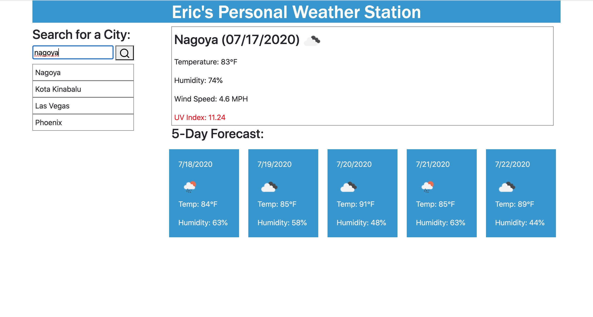
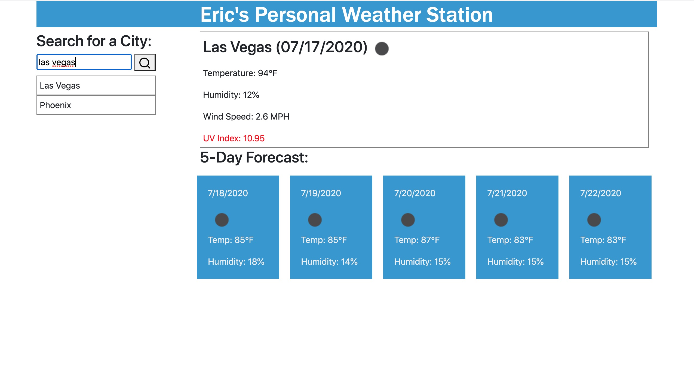

 ## Application
 Weather Dashboard 
 
### Project Description
Search current weather and 5 day forecast anywhere in the world
### How to Install
Clone the github and run from VS Code in the browser or you can run the application from github https://jahugawugasuga.github.io/Weather-Information-Database/
### How to Use this Application
Search any city in the search bar, data will persist in the browser
===

### Techology Used
openweather API
Javascript, CSS, HTML

### Project Contributers
Jahugawugasuga
### Future Dev
Limit the amount of history cities
Don't allow duplicate history cities

